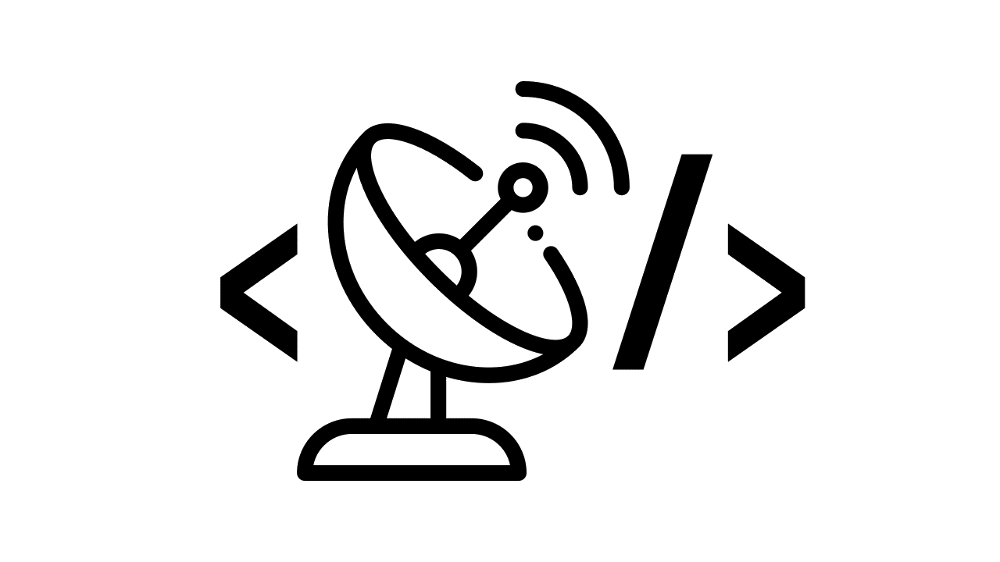

    
    <h1 align="center">DevRadar</h1>

## Contents

* [About the Project](#about-the-project)
* [Built With](#built-with)
* [Contact](#contact)

## About the Project
An app resulted from Semana OmniStack 10.0. The application has the web version, where you register the devs, and the mobile version, where devs appear within a radius of 15 km according to the filters you enter.

## Built With
* [React](https://reactjs.org)
* [React Native](https://facebook.github.io/react-native/)
* [Expo](https://expo.io/)
* [Node.js](https://nodejs.org/en/)

## Install and Run
You need to have [node](https://nodejs.org/en/download/) and [yarn](https://yarnpkg.com/) installed in your machine. Then, you can clone this repository

### Backend
Run the following commands inside the /backend folder:
1. `yarn install`
2. `yarn dev`

Backend will run at [localhost:3333](http://localhost:3333).

### Frontend
Run the following commands inside the /frontend folder:
1. `yarn install`
2. `yarn start`

Frontend will run at [localhost:3000](http://localhost:3000).

### Mobile
Run the following commands inside the /mobile folder:
1. `yarn install`
2. `yarn start`

If you're using an emulator, the project will run at [localhost:19000](http://localhost:3000). If you're using your device, you can read the generated QR Code in the Expo Client app.

## Contact
E-mail: ghffadel@gmail.com
